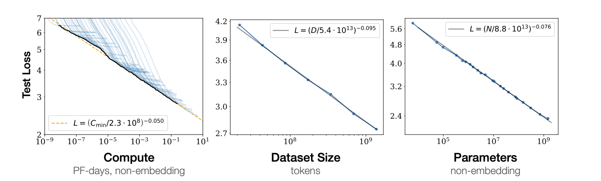
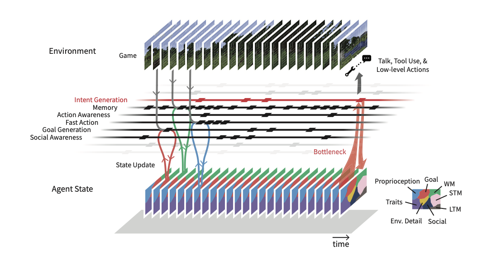

# Introduction to GPU Programming and Parallelizationn

# Part 1: From Amdahl's Law to Empirical Scaling Laws 

## Information Theory and Parallization

Information processing — whether in biological systems or computer architectures — relies on parallelization to handle complexity efficiently. Claude Shannon's information theory demonstrates that processing information inherently demands time, energy, and space. As the volume of information grows, sequential processing becomes a bottleneck, making parallel processing essential for scaling.
Amdahl's Law, often cited as a limitation on parallel speedup, actually reveals a deeper truth: systems that survive and propagate inevitably evolve toward parallel and heterogeneous architectures. While the law states that sequential bottlenecks limit overall speedup, it also highlights why successful systems—both biological and artificial—minimize these dependencies by distributing tasks across specialized units. 

Amdahl's Law, often cited as a limitation on parallel speedup, reveals a deeper truth: systems that survive and propagate inevitably evolve toward parallel and heterogeneous architectures. By highlighting the constraints imposed by sequential bottlenecks, the law underscores the importance of minimizing dependencies through specialized units, such as CPUs, GPUs, and ASICs. This principle is evident in both biological systems—like the brain's parallel sensory pathways—and modern computing architectures that offload tasks to appropriate processors for scalability.

*Figure 1: Amdahl's Law demonstrates how the parallel portion of a program determines the maximum possible speedup with increased computing resources. It highlights the diminishing returns as sequential bottlenecks dominate.*

The implications of Amdahl's Law extend to the design of modern computing systems. Real-world applications often have serial and parallel components, making heterogeneous techniques essential for significant speedups. For example, GPUs coordinate thousands of cores to achieve massive computational throughput, mirroring the efficiency of biological systems that allocate tasks across specialized circuits.

For those interested in exploring the topic of performance and power consumption in heterogeneous computing systems further, see:

For further exploration, see Speedup and Power Scaling Models for Heterogeneous Many-Core Systems (Rafiev et al., 2018): https://ieeexplore.ieee.org/abstract/document/8255653

Modern GPUs exemplify this principle in computing, processing thousands of operations simultaneously to achieve massive computational throughput. Similar to how your brain coordinates activity across circuits to process sensory information and determine future sequences of actions, GPUs coordinate thousands of processing cores to tackle complex computational tasks efficiently. 

## From Amdahl to Modern Scaling Laws

The principles underlying Amdahl's Law have found new relevance in the era of large language models and neural networks. Just as Amdahl's Law describes how parallel portions of programs determine potential speedup, modern scaling laws reveal how model performance improves with increased computation and data:

*Figure 2: Language model performance exhibits predictable scaling behavior with increased model size, dataset size, and compute resources. Implicit in Kaplan et al. (2020) is the connection between parallelization and GPU performance.*

## Connections in Computer and Cognitive Science (Parallel Distributed Proccessing)

The concept of parallel processing has deep roots in both computer science and cognitive science. The work of McClelland, Rumelhart, and Hinton on Parallel Distributed Processing (PDP) [1] helped establish foundational principles that bridge biological and artificial information processing systems. Their work demonstrated how complex behaviors can emerge from parallel processing of simple computational units - a principle that remains relevant in modern GPU computing, where thousands of simple cores work together to solve complex problems.

See PDP Handbook developed by Dr. McClelland here: 
https://web.stanford.edu/group/pdplab/pdphandbook/handbook.pdf

The principles outlined in PDP laid the groundwork for understanding how parallel computation can produce emergent complexity. This is directly mirrored in modern GPU architectures, where thousands of cores operate in unison to solve intricate problems in AI and data science.

## Types of Parallelism
Modern GPU computing implements several distinct forms of parallelism, each suited to different types of computational problems:

### Data Parallelism
**Definition:** The distribution of data across multiple processing units, where the same operation is performed on different data elements simultaneously.

**CUDA Context:** In CUDA C++, this is implemented through thread blocks processing different portions of input data arrays.

**Additional Resources:**
- [NeMo Framework and Data Parallelism](https://docs.nvidia.com/nemo-framework/user-guide/latest/nemotoolkit/features/parallelisms.html)
- [Data Parallelism Overview](https://en.wikipedia.org/wiki/Data_parallelism)

### Task Parallelism
**Definition:** Different operations are performed concurrently on different processing units, potentially on the same or different data.

**CUDA Context:** Implemented through CUDA streams and multiple kernels executing concurrently.

**Additional Resources:**
- [Introduction to Task-Based Parallelism](https://hpc2n.github.io/Task-based-parallelism/branch/spring2021/motivation/)
- [Task Parallelism Overview](https://en.wikipedia.org/wiki/Task_parallelism)

### Instruction-Level Parallelism (ILP)
**Definition:** Multiple instructions from the same thread executing simultaneously when they don't have dependencies.

**CUDA Context:** Both CPU and GPU architectures employ ILP, but GPUs focus more on thread-level parallelism.

**Additional Resources:**
- [Instruction-Level Parallelism](https://en.wikipedia.org/wiki/Instruction-level_parallelism)

### Thread-Level Parallelism (TLP)
**Definition:** Multiple threads executing independently and simultaneously across available processing units.

**CUDA Context:** The primary form of parallelism in CUDA, where thousands of threads can execute the same kernel on different data.

**Additional Resources:**
- [Thread-Level Parallelism, SMT, and CMP](https://www.cs.umd.edu/~meesh/411/CA-online/chapter/thread-level-parallelism-smt-and-cmp/index.html)

## Benefits of Using GPUs

### Architectural Differences
CPUs and GPUs are designed with fundamentally different goals in mind:

**CPU Design Focus:**
- Optimized for sequential processing
- Executes a sequence of operations (thread) as fast as possible
- Capable of handling a few tens of threads in parallel
- Large cache hierarchy for data access optimization
- Complex flow control mechanisms

**GPU Design Focus:**
- Optimized for parallel processing
- Executes thousands of threads simultaneously
- Amortizes slower single-thread performance through massive parallelization
- More transistors devoted to data processing units
- Simpler flow control mechanisms

### Memory Architecture
**CPU Memory Hierarchy:**
- Multiple cache levels (L1, L2, L3)
- Large cache sizes to minimize memory access latency
- Complex memory management units

**GPU Memory Strategy:**
- Simpler cache hierarchy (primarily L1 and L2)
- Focuses on throughput over latency
- Hides memory access latencies through parallel execution
- More efficient use of transistors for computation rather than caching

### Performance Characteristics
- GPUs excel at highly parallel computations
- Optimized for floating-point operations
- Better performance per watt for parallel workloads
- More effective use of silicon area for compute operations

See Charles Frye's post for Modal: https://modal.com/gpu-glossary
And Fabien Sanglard: https://fabiensanglard.net/cuda/

# Part 2: CUDA - Bridging Hardware and Software

## CUDA and Expressive Languages for Hardware Communication and Compatibility

While GPU architecture provides the hardware foundation for parallel computing, harnessing this power effectively required a revolutionary software approach. In 2006, NVIDIA introduced CUDA (Compute Unified Device Architecture) to bridge the gap between parallel hardware capabilities and practical software development [2].

### Historical Context and Development

Innovation in the software stack marked a crucial shift from GPUs being solely graphics processors to becoming general-purpose computing platforms. This transformation enabled the development of highly parallel applications, from scientific computing to artificial intelligence.

See here for a more complete [history of NVIDIA SMs](https://fabiensanglard.net/cuda/) from Fabien Sanglard. 

### Key Milestones in CUDA Development
- **2006:** Initial CUDA announcement at Supercomputing Conference
- **2007:** First public CUDA SDK release (CUDA 1.0)
- **2008:** Introduction of unified memory architecture
- **2010:** Release of cuBLAS and cuFFT libraries
- **2012:** Dynamic Parallelism introduction in CUDA 5.0
- **2014:** CUDA 6.0 brings automated memory management
- **2016:** CUDA 8.0 adds native FP16 support, critical for deep learning

### Technical Evolution of CUDA with Hardware Scaling
#### Early CUDA Architecture (2006-2010)
- **Initial Threading Model**
 - Basic grid and block abstractions
 - Limited to 65,535 thread blocks per grid
 - Maximum 512 threads per block
 - Hardware: Tesla architecture with hundreds of CUDA cores

#### Scaling to Thousands of Cores (2010-2014)
- **Advanced Threading Capabilities**
 - Introduction of Dynamic Parallelism in CUDA 5.0
 - Nested kernel launches
 - GPU-initiated kernel execution
 - Hardware: Fermi and Kepler architectures with thousands of CUDA cores

#### Massive Parallelism Era (2014-Present)
- **Memory and Thread Management**
 - Unified Memory Architecture
 - Automatic memory management
 - Thread block clustering
 - Hardware: Maxwell, Pascal, Volta, and Ampere architectures with tens of thousands of CUDA cores

### Key Technical Features for Scaling
1. **Memory Hierarchy Abstraction**
  - Shared Memory programming model
  - L1/L2 cache management
  - Global memory coalescing
  - Atomic operations support

2. **Warp-Level Primitives**
  - Cooperative Groups
  - Warp shuffles
  - Warp aggregated atomics
  - Thread block synchronization

3. **Workload Distribution**
  - Multi-GPU support
  - Peer-to-peer communication
  - Asynchronous execution
  - Stream management

### Impact on Deep Learning
The CUDA platform played a pivotal role in the deep learning revolution of the 2010s. Key developments include:
- **2012:** AlexNet's breakthrough in ImageNet competition, powered by CUDA GPU acceleration [3]
- **2014:** Introduction of cuDNN (CUDA Deep Neural Network) library
- **2015:** Development of major frameworks like TensorFlow and PyTorch with CUDA support

*Note: AlexNet was trained on two [NVIDIA GTX 580 GPUs](https://www.nvidia.com/docs/IO/100940/GeForce_GTX_580_Datasheet.pdf) in 2012. The GTX 580 was based on the Fermi architecture and had 512 CUDA cores. 

### Software Stack Evolution
NVIDIA's comprehensive software stack development was crucial for adoption:
- High-level APIs and libraries
- Optimized primitives for deep learning
- Integration with popular frameworks
- Developer tools and profiling capabilities

## References
[1] McClelland, J. L., Rumelhart, D. E., & Hinton, G. E. (1986). [Parallel Distributed Processing: Explorations in the Microstructure of Cognition. Volume 1: Foundations](https://stanford.edu/~jlmcc/papers/PDP/Chapter1.pdf). MIT Press.

[2] Nickolls, J., Buck, I., Garland, M., & Skadron, K. (2008). [Scalable Parallel Programming with CUDA](https://dl.acm.org/doi/10.1145/1365490.1365500). Queue, 6(2), 40-53.

[3] Krizhevsky, A., Sutskever, I., & Hinton, G. E. (2012). [ImageNet Classification with Deep Convolutional Neural Networks](https://papers.nips.cc/paper/2012/hash/c399862d3b9d6b76c8436e924a68c45b-Abstract.html). NeurIPS.

### Benefits of Abstraction: From Hardware to Agent Systems
*[A Rabbit Hole Exploration]*

One of the key features of CUDA C++ is its ability to provide developers with abstractions for partitioning complex problems. This hierarchical approach enables:

- Division of problems into coarse subtasks for parallel execution across thread blocks
- Further decomposition into fine-grained tasks for thread-level parallelism
- Automatic scalability through cooperative computing across streaming multiprocessors (SMs)

#### Parallel Patterns: From GPUs to AI Agents (Benefits of Abstraction)

Similar patterns of abstraction and task decomposition are emerging in modern AI agent architectures:

- **LangGraph and Agent Frameworks**: These tools provide programming interfaces for orchestrating multi-agent systems, managing dependencies, communication, and task allocation—similar to how CUDA handles thread blocks.
- **Task Decomposition**: Just as GPU threads coordinate within blocks, AI agents can be organized into cooperative groups to tackle complex tasks.
- **Hierarchical Control**: CUDA manages multiple levels of parallelism, while agent systems require orchestration at global and local scales to ensure seamless coordination.

#### Dynamic Scheduling: From Thread Blocks to Agent Tasks

In CUDA architecture, each block of threads can be scheduled on any available multiprocessor within a GPU in any order, concurrently or sequentially. This flexibility means a compiled CUDA program can execute on any number of multiprocessors, with only the runtime system needing to know the actual multiprocessor count.

This architectural principle has fascinating parallels in modern multi-agent systems. For instance, Altera [7] demonstrates how agent behaviors can be modularly designed and dynamically scheduled, similar to GPU thread blocks. Just as CUDA runtime manages thread block distribution, multi-agent frameworks can orchestrate task distribution across available agent resources without requiring individual agents to understand the full system topology.

#### Future Implications
The lessons learned from GPU programming models might inform the development of:
- Control systems for coordinated robotics in manufacturing
- Multi-agent planning systems for logistics and navigation
- Distributed AI systems requiring fine-grained coordination

*This parallel between GPU architecture patterns and emerging AI systems suggests that the principles of parallel computation scale beyond hardware to higher-level problem spaces.*

*PIANO (Parallel Information Aggregation via Neural Orchestration), an architecture that enables agents to run multiple processes concurrently while maintaining cohesive behavior through a central decision-making system. This is helpful in considering how heterogeneuous systems enable GPU developers to overcome the upper bounds imposed on parallel processing systems in Amdahl's Law.*

For example, in logistics planning, PIANO could enable fleets of autonomous delivery vehicles to operate concurrently, coordinating routes and deliveries while ensuring cohesive, system-level decision-making through distributed processing and centralized orchestration. Similarly, in large-scale AI workflows, PIANO could facilitate efficient communication between data centers, optimizing resource allocation and reducing costs during intensive training runs.

**Additional Resources:**
- [LangGraph: Building Language Agent Systems](https://github.com/langchain-ai/langgraph) [4]
- [LangChain Expression Language (LCEL)](https://python.langchain.com/docs/expression_language/) [5]
- [Multi-Agent Systems Overview](https://www.sciencedirect.com/topics/computer-science/multiagent-system) [6]

[Add to References section:]
[4] Harrison Chase et al. (2024). [LangGraph: A Graph-Based Approach to LLM Orchestration](https://github.com/langchain-ai/langgraph). LangChain.

[5] LangChain. (2024). [LangChain Expression Language Documentation](https://python.langchain.com/docs/expression_language/). LangChain Documentation.

[6] Wooldridge, M. (2009). [An Introduction to MultiAgent Systems](https://www.sciencedirect.com/book/9780470519460/an-introduction-to-multiagent-systems). John Wiley & Sons.

[7] Altera.AL (2024). [Project Sid: Many-agent simulations toward AI civilization](https://arxiv.org/abs/2411.00114)

