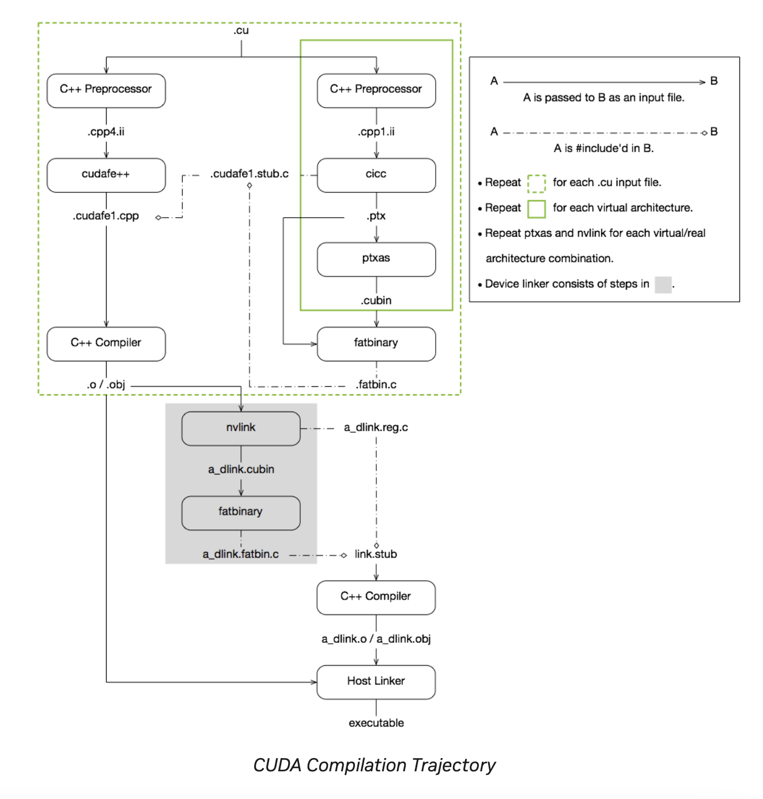

# Compilation with NVCC

## Introduction

CUDA C++ provides a simple and efficient path for users familiar with C++ to write programs that execute on NVIDIA GPUs. The `nvcc` compiler is a key tool in this workflow, enabling the compilation of CUDA kernels and host code into binary forms suitable for execution on NVIDIA hardware. This document focuses on the NVCC compilation process, targeting the H100 architecture, and provides examples and insights for optimizing code performance on heterogeneous compute architectures.

---

## Programming Interface

CUDA C++ extends the C++ language with minimal extensions and provides a runtime library to enable GPU programming. This allows programmers to define kernels as functions and specify execution configurations with grid and block dimensions. Key features include:

- **Language Extensions**: Simplified syntax for defining kernels and execution configurations.
- **Runtime API**: Tools for memory management, device management, and kernel execution.
- **Driver API**: Lower-level control over CUDA contexts and modules for advanced use cases.

---

## Compilation with NVCC

### Compilation Workflow

#### Offline Compilation

Offline compilation involves separating device and host code. The `nvcc` compiler:

CUDA Compiler Driver NVCC
https://docs.nvidia.com/cuda/cuda-compiler-driver-nvcc/

1. Compiles device code into PTX (assembly) or binary (cubin) forms.
2. Modifies host code to replace execution configuration syntax (`<<<...>>>`) with runtime API calls.

### Example:
```bash
nvcc x.cu -gencode arch=compute_50,code=sm_50 \
          -gencode arch=compute_60,code=sm_60 \
          -gencode arch=compute_70,code="compute_70,sm_70"
```



#### Just-in-Time Compilation

PTX code can also be compiled at runtime by the device driver for compatibility with newer hardware. Just-in-time compilation ensures:

- Compatibility with future architectures.
- Optimized performance leveraging driver-level improvements.

---

### 3.1.2. Binary and PTX Compatibility

#### Binary Compatibility
- Binary code is architecture-specific, defined using `-code` (e.g., `-code=sm_80` for compute capability 8.0).
- Compatibility is guaranteed within minor revisions but not across major revisions.

#### PTX Compatibility
- PTX instructions depend on the compute capability specified with `-arch`.
- PTX code is forward-compatible, allowing execution on devices with higher compute capabilities.

### Example:
```bash
nvcc x.cu -arch=compute_80
```

This ensures compatibility with devices of compute capability 8.0 or higher.

---

## Application Compatibility

To ensure application compatibility with heterogeneous architectures:

1. Embed PTX and binary code for multiple compute capabilities.
2. Use the `__CUDA_ARCH__` macro to differentiate code paths for specific architectures.

### Example:
```cpp
#if __CUDA_ARCH__ >= 800
    // Code optimized for compute capability 8.0 and higher
#else
    // Fallback for older architectures
#endif
```

---

## Focus: H100 Architecture

The NVIDIA H100 GPU introduces advanced features such as:

1. **Tensor Cores**: Optimized for AI workloads.
2. **Data Center Interconnects**: Support for heterogeneous computing.
3. **Independent Thread Scheduling**: Enhanced flexibility in thread scheduling.

### Optimized Compilation for H100:
```bash
nvcc x.cu -gencode arch=compute_90,code="compute_90,sm_90"
```

This generates both PTX and binary code targeting compute capability 9.0 for H100 devices.

---

## Code Example

### Matrix Multiplication Example (Optimized for H100):

```cpp
__global__ void matrixMultiply(float *A, float *B, float *C, int N) {
    int row = blockIdx.y * blockDim.y + threadIdx.y;
    int col = blockIdx.x * blockDim.x + threadIdx.x;
    float sum = 0;

    for (int i = 0; i < N; i++) {
        sum += A[row * N + i] * B[i * N + col];
    }

    C[row * N + col] = sum;
}

int main() {
    // Memory allocation and kernel launch code
}
```

Compile for H100:
```bash
nvcc matrixMultiply.cu -gencode arch=compute_90,code="compute_90,sm_90"
```

---

## Conclusion

Understanding the NVCC compilation process and its role in generating PTX and binary code is essential for optimizing CUDA applications, especially for advanced architectures like the NVIDIA H100. Proper use of `-arch` and `-code` options ensures compatibility and performance across diverse compute environments.
